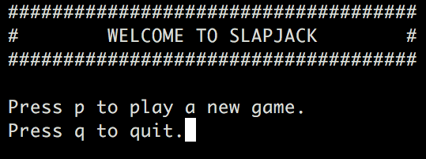
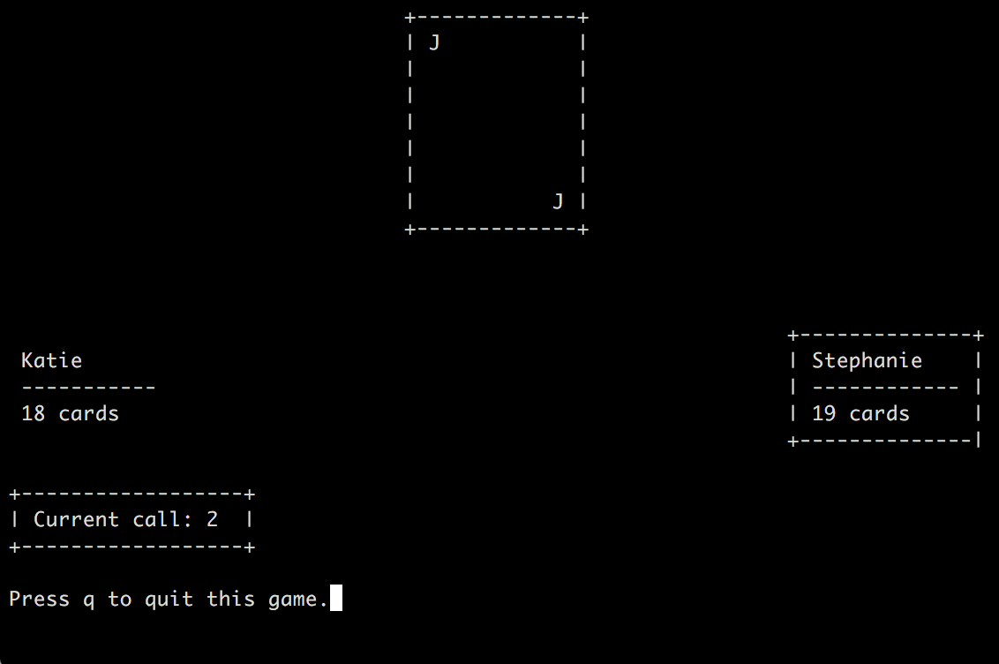

# Slapjack
> A game of two-player Slapjack in your console.



### Game Rules
This version of Slapjack is played with the standard 52-card deck and two players. A player wins when their opponent loses all of their cards.

Each player begins with 26 cards in their hand. Player 1 begins the game by playing a card to the pile and calling "Ace". Then, player 2 plays a card to the pile and calls "Two". The players will continue to play cards to the pile and call the next card ranks. After "Ten", "Jack", "Queen", and "King", the call begins again from "Ace" and continues.

When a jack is played, the first player to slap the pile wins all the cards in pile. Similarly, if the card played matches the card rank that is called (i.e. if someone plays a "Five" and calls "Five"), the first player to slap the pile wins all the cards in the pile. After a card is slapped, play begins again with whoever won the slap, and the call restarts at "Ace".

### Play the Game


##### Requirements
You must have either Python 2.7 or Python 3.5+ to run the game.

##### Run the Game
Navigate to the directory in your console and then run:
```sh
$ python slapjack
```

##### Keyboard Commands
To play a new game of Slapjack, press `p`. To quit the game, press `q`.

|               | Player 1      | Player 2      |
|---------------|---------------|---------------|
| Play a card   | `z`, `x`, `c` | `,`, `.`, `/` |
| Slap the pile | `a`, `s`, `d` | `l`, `;`, `'` |


### Design Decisions

I created separate `Card`, `Player`, and `Slapjack` classes to modularize my code. Each of the `Card`, `Player`, and `Slapjack` classes store relevant information as instance variables and have methods that generate strings to be displayed on the terminal screen.

The `__main__.py` class is separate from the above classes, and takes care of user input and rendering the game logic as information on the terminal screen.

##### External Python Libraries Used
* `curses`
* `enum`
* `itertools`
* `random`
